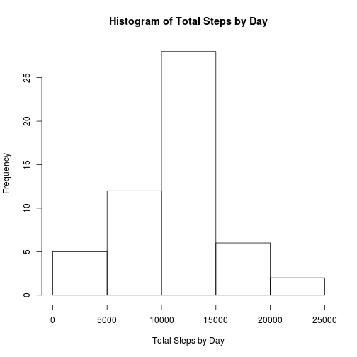
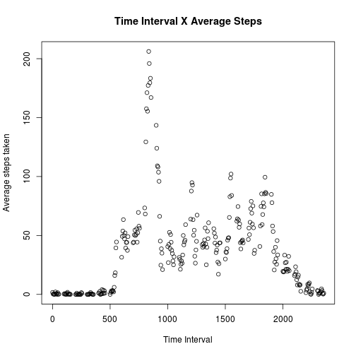
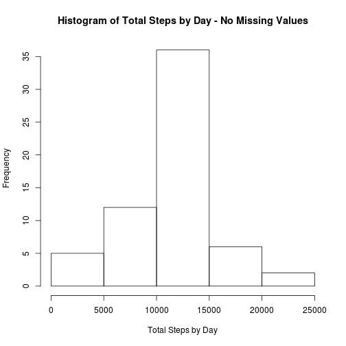
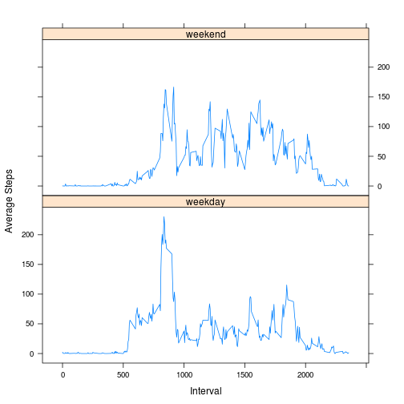

This is the report that answers questions to the Peer Assesment 1 of the Reproducible Research course.  
It's assumed that the current directory contains the data in the file named activity.zip.


## Loading and preprocessing the data
The following steps are taken to load data into memory:  

1. Unzip file into activity.scv  

```r
unzip("activity.zip")
```
2. Load data into **data** variable  

```r
data <- read.csv("activity.csv", header = TRUE)
```
No processing/transformation is necessary at this moment.  

## What is mean total number of steps taken per day?

To make a histogram of the total number of steps taken each day, all steps are summed by day in **totalStepsByDay** variable, then the histogram is plotted, as follows:  


```r
totalStepsByDay <- aggregate(. ~ date, data=data, FUN=sum)
hist(totalStepsByDay$steps, xlab = "Total Steps by Day", main = "Histogram of Total Steps by Day")
```

 


Using the dataset created in the step above is easy to calculate the **mean** and the **median** of the steps taken for the entire data. The following code demonstrates how to calculate those values:


```r
ma1 <- mean(totalStepsByDay$steps)
ma2 <- median(totalStepsByDay$steps)
```

The calculated values are:  
* mean: 10766.2 rounded to 1 digit  
* median: 10765  

## What is the average daily activity pattern?


The following code calculates the average steps taken by time interval, and plots the results:


```r
avgStepsByTimeInterval <- aggregate(. ~ interval, data=data, FUN=mean)
plot(x = avgStepsByTimeInterval$interval, y = avgStepsByTimeInterval$steps, xlab = "Time Interval", yla = "Average steps taken", main = "Time Interval X Average Steps")
```

 


## Imputing missing values

The first requirement is to calculate how many values are missing:


```r
missing <- sum(is.na(data$steps))
```

There are **2304** missing values in original dataset.  

The next two requirements ask to devise a strategy for filling in all of the missing values in the dataset and to apply this strategy into the original dataset, creating a new one.  
The strategy adopted was to use the mean for that 5-minute interval, applied by the following piece of code (in the variable **noMissingData**:

```r
noMissingData <- data
for (i in 1:nrow(noMissingData)) {
  if (is.na(noMissingData[i, 1])) {
    noMissingData[i, 1] <-  avgStepsByTimeInterval[avgStepsByTimeInterval$interval == noMissingData[i, 3], 2]
  }   
}
```

The last requirement is to replot the histogram and recalculate the mean and median values, which now is done over the noMissingData variable:

```r
totalStepsByDayNoMissing <- aggregate(. ~ date, data=noMissingData, FUN=sum)
mb1 <- mean(totalStepsByDayNoMissing$steps)
mb2 <- median(totalStepsByDayNoMissing$steps)
hist(totalStepsByDayNoMissing$steps, xlab = "Total Steps by Day", main = "Histogram of Total Steps by Day - No Missing Values")
```

 


The mean and median values, with missing values filled with the mean for matching 5-minute interval, are respectively **10766.2** and **10766.2** (rounded to 1 digit).


## Are there differences in activity patterns between weekdays and weekends?

Code to evaluate if a date is weekday or weekend:

```r
noMissingData$dayType <- factor((as.POSIXlt(noMissingData$date)$wday %in% c(0, 6)), labels=c("weekday", "weekend"))
```

Code to calculate de average values for weekdays and weekends:

```r
avgStepsByTimeIntervalAndDayType <- aggregate(. ~ interval + dayType, data=noMissingData, FUN=mean)
```

And finally plot the differences:

```r
library(lattice)
xyplot(steps ~ interval | dayType, data = avgStepsByTimeIntervalAndDayType, layout = c(1, 2), type = "l", ylab = "Average Steps", xlab = "Interval")
```

 
